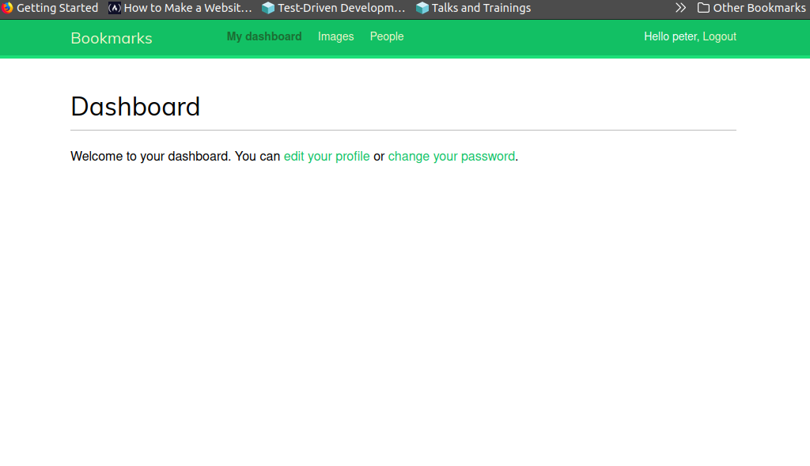
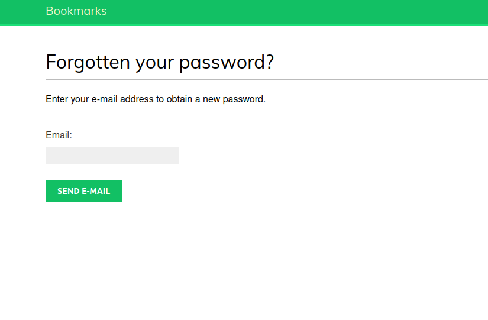

# Django account boilerplate
 

  
&nbsp; &nbsp; &nbsp; &nbsp;
  

  
&nbsp; &nbsp; &nbsp; &nbsp;
  

project/
|-- app1/
|-- app2/
|-- project/
|   |-- __init__.py
|   |-- settings.py
|   |-- urls.py
|   |-- asgi.py
|   |-- wsgi.py
|-- static/
|-- media/
|-- templates/
|-- manage.py

